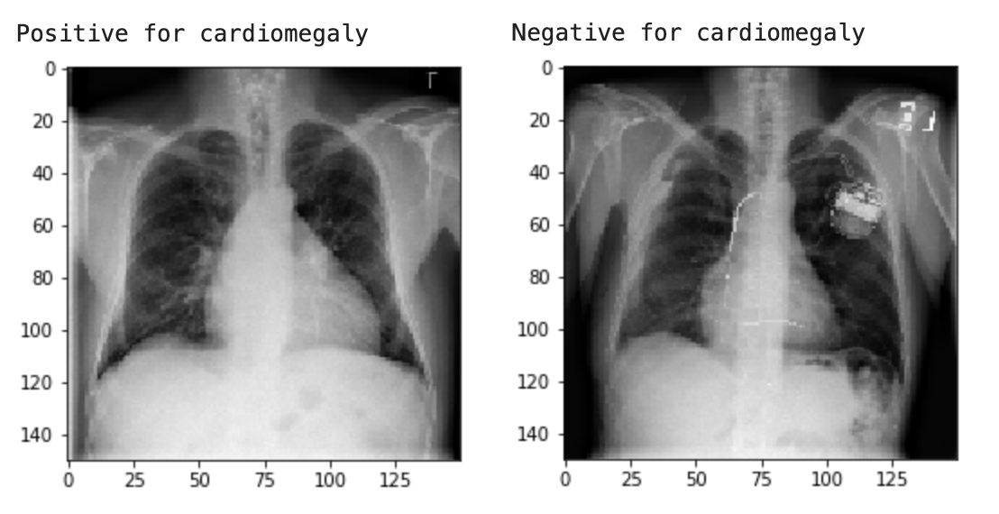
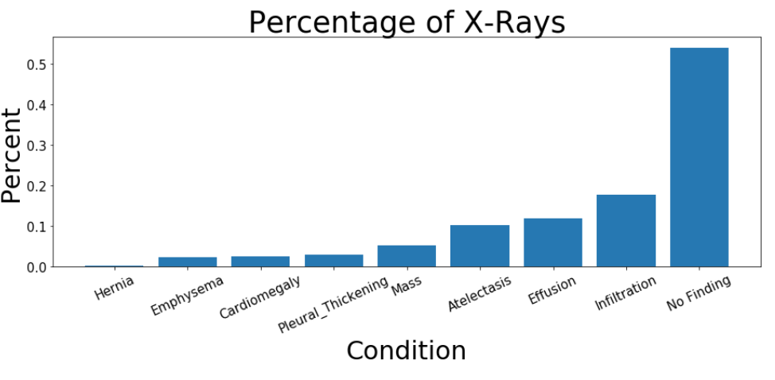
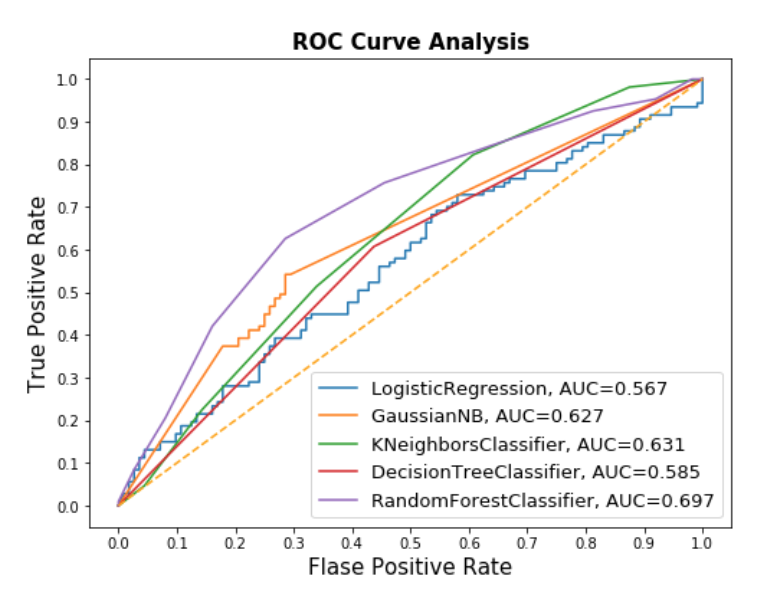
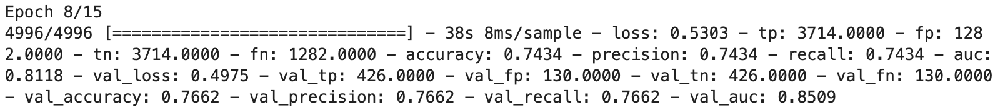

# Cardiomegaly Detection In Chest X-Rays Using Machine Learning

This project is designed to give patients a "second opinion" of their chest X-ray. This is accomplished by training a Convolutional Naural Network Sequential model on 112K labled images of chest X-rays and hosting the model on the internet for free and open access.

## Getting Started

To reproduce this project, follow the src_tensorflow_keras.py files documentation for prerequesits and instructions and see the src directory for source code documentation. The class created is designed to run on any system that has the hardware requirements. The data for training is stored in the AWS cloud in a publicly available s3 bucket.

### Prerequisites

Hardware Utilized: Amazon Web Services EC2 Instances, Amazon Sagemaker, Amazon S3 Storage. 
Software: Docker, Python 3

### Project Motivation

Cardiomegaly is usually a sign of another condition such as a heart valve problem or heart disease. It may also signal a prior heart attack. Providing Radiologists a tool to assist with their readings will enable them to spend more time with patients and providing a tool for patients to get a second opinion may prevent misreadings and improve quality of care. 

### Goal

Detect cardiomegaly in chest x-rays with a high degree of accuracy.

### Overview of the Data & EDA

The [National Institute of Health](https://nihcc.app.box.com/v/ChestXray-NIHCC) released 112,121 chest x-ray images from ~30,000 patients. There are 15 other conditions in the chest x-rays but I chose to focus on Cardiomegaly.

### Modeling with Decision Trees and Logistic Regression

In all modeling of a medical classification, the false positive rate is the most important factor. There is great signifance if a positive case is not caught. 

Modeling with Logistic Regression, Random Forests, Support Vector Machines and Gradient Boosting revealed Random Forests to be the best option as it had the best recall (tied with Gradient Boosting) but the computation required to train the model was only a fraction of the Gradient Boosting Model. A recall of only .6 was achieved with these models.

### Modeling with Convolutional Neural Networks

A secuential convolutional neural network was compiled. The model consisted of 8 layers that would intake the image and output a classification prediction. This resulted in a model with total params of 918,850, 917,858 of which were trainable.

After only 8 epochs a recall of .75 was achieved. 

### Conclusion and Next Steps

I am currently working on an open website that enables users to upload pictures of their chest x-rays for the model to classify. 

Explore training additional CNN models on the other diseases in the dataset. 

